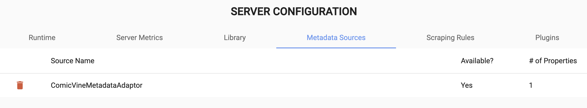
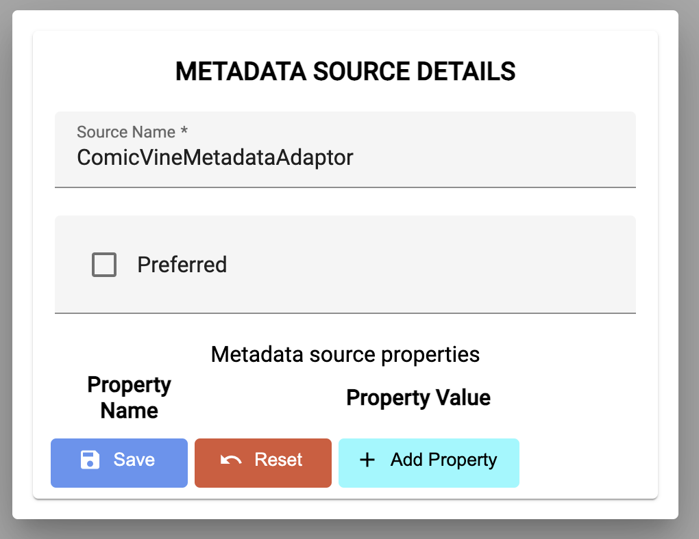
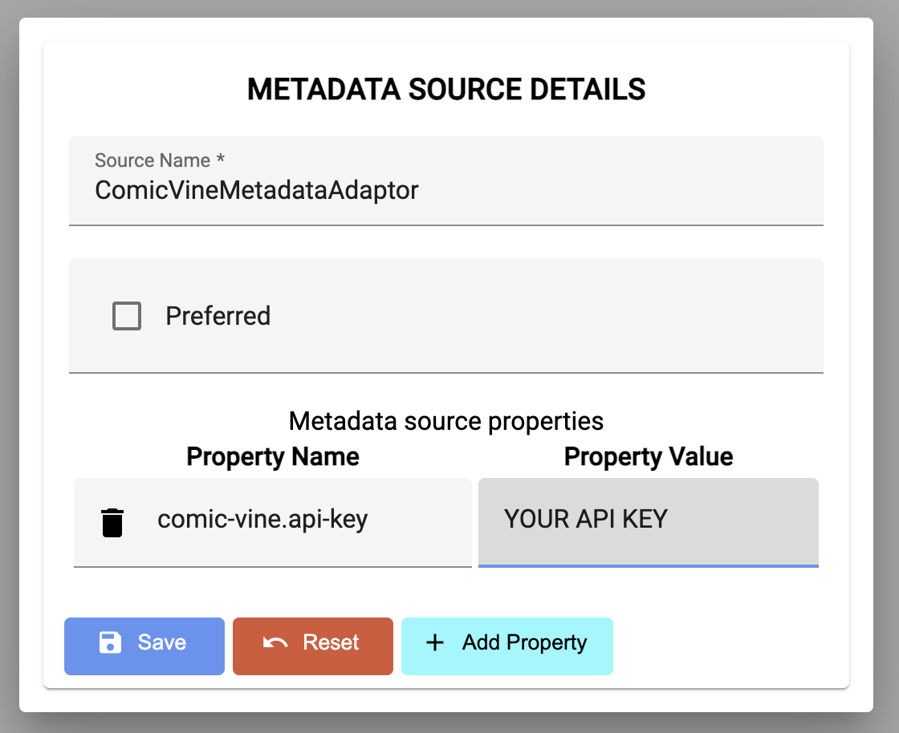

# Installing The ComicVine Metadata Adaptor

1. Download the latest release bundle from [here](https://github.com/comixed/comixed-metadata-comicvine/releases).
1. Extract the **comixed-metadata-comicvine-*.jar** file from the archive.
1. Copy this file to your ```$HOME/.comixed/extensions``` directory.
1. Restart your ComiXed server.


# Configuring The Adaptor

1. You need to first get a [ComicVine API Key](https://comicvine.gamespot.com/api/).
1. Go to the **Configuration** page.
1. Open the **Metadata Sources** tab.
1. In the list of available sources you should see the following:

1. Click on the entry for **ComicVineMetadataAdaptor** and a dialog box will appear:

1. Click on the **Add Property** button.
1. Create a new property with a property name of **comic-vine.api-key**.
1. Set your ComicVine API key value.
1. Set the delay (in seconds) to use between volume and issue requests.

1. **Optional** mark this as your preferred metadata source.
1. Click the **Save** button.

**NOTE:** Any delay of less than 1 second is ignored and the default of 1
second will be used.

You should now be able to scrape comics using the ComicVine database!
